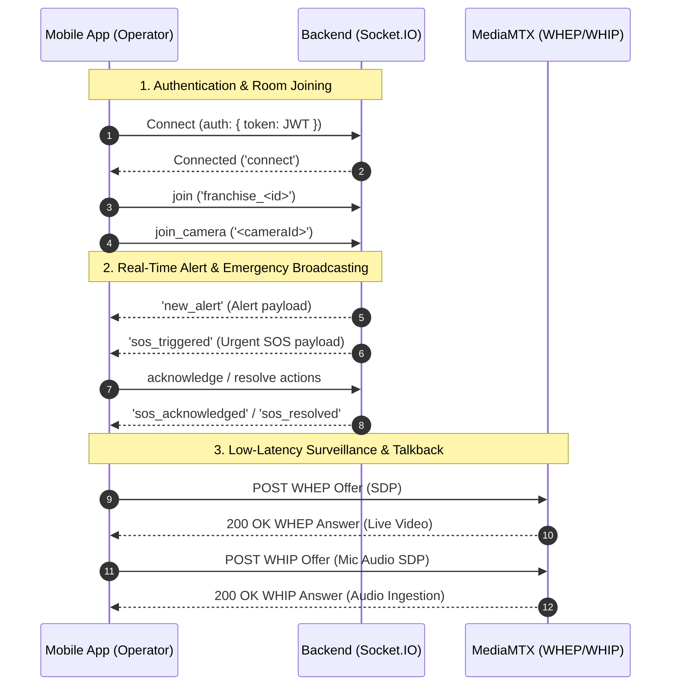

# CCTV Monitoring Platform - Operator Mobile App

[](https://reactnative.dev)
[](https://react.dev)
[](https://www.typescriptlang.org)
[](https://redux-toolkit.js.org)
[](https://webrtc.org)
[](https://socket.io)
[](#prerequisites--environment-setup)
[](#architecture--tech-stack)

> **Enterprise-grade CCTV Surveillance, Real-Time Incident Response & Security Operations Mobile Client for Android & iOS.**

---

## 📑 Table of Contents

- [Overview](#overview)
- [Key Features](#key-features)
  - [Authentication & Session Security](#authentication--session-security)
  - [Shift Lifecycle & Operator Dashboard](#shift-lifecycle--operator-dashboard)
  - [Live Camera Surveillance & Playback](#live-camera-surveillance--playback)
  - [Real-Time Alert Triage](#real-time-alert-triage)
  - [SOS Emergency Response](#sos-emergency-response)
  - [Two-Way Audio Talkback](#two-way-audio-talkback)
  - [Incident Management & Reporting](#incident-management--reporting)
  - [Performance Analytics & Shift Reports](#performance-analytics--shift-reports)
  - [Notifications & Preferences](#notifications--preferences)
- [Architecture & Tech Stack](#architecture--tech-stack)
- [Codebase Structure](#codebase-structure)
- [Environment Configuration](#environment-configuration)
- [Prerequisites & Environment Setup](#prerequisites--environment-setup)
- [Getting Started & Local Development](#getting-started--local-development)
  - [1. Clone and Install Dependencies](#1-clone-and-install-dependencies)
  - [2. Configure Environment](#2-configure-environment)
  - [3. iOS CocoaPods Setup](#3-ios-cocoapods-setup)
  - [4. Start Metro Bundler](#4-start-metro-bundler)
  - [5. Run on Android or iOS](#5-run-on-android-or-ios)
- [Deep Linking Scheme](#deep-linking-scheme)
- [Real-Time Socket.IO & Streaming Engine](#real-time-socketio--streaming-engine)
- [API Architecture & Endpoints](#api-architecture--endpoints)
- [Design System & Theme Tokens](#design-system--theme-tokens)
- [Testing & Quality Assurance](#testing--quality-assurance)
- [Troubleshooting & Common Issues](#troubleshooting--common-issues)
- [Documentation & Testing Guides](#documentation--testing-guides)

---

<a id="overview"></a>
## 🌟 Overview

The **CCTV Operator Mobile App** is a specialized mobile application built for security control rooms, franchise operators, and on-field surveillance personnel. It connects directly with the backend surveillance microservices and MediaMTX WebRTC streaming gateway to provide:

- **Ultra-low latency live video feeds** (<500ms via WebRTC / WHEP)
- **Instant bi-directional audio talkback** (WHIP push-to-talk to camera loudspeakers)
- **High-priority SOS emergency handling** with sound, visual pulsing, and fast dispatch coordination
- **Comprehensive alert triage workflow** (Acknowledge ➔ Escalate ➔ Resolve / False Positive Verify)
- **Strict operator shift lifecycle** (Clock-in, real-time shift duration counter, handover notes, and performance tracking)
- **Incident lifecycle tracking** with multi-part evidence attachments and printable audit reports

The app is built on **React Native Bare Workflow** to guarantee full native support for WebRTC hardware acceleration, audio track routing, hardware-backed Keychain keystore encryption, and deep OS-level notifications.

---

<a id="key-features"></a>
## ✨ Key Features

<a id="authentication--session-security"></a>
### 🔐 Authentication & Session Security
- **Multi-Identifier Login**: Sign in using registered email or mobile phone number with password.
- **Self-Service Password Recovery**: Request OTP via email, verify 6-digit OTP, receive one-time `resetToken`, and securely reset account password.
- **Hardware-Backed Secure Storage**: Access and refresh tokens stored using `react-native-keychain` (`WHEN_UNLOCKED_THIS_DEVICE_ONLY`).
- **Silent JWT Rotation Interceptor**: Automated Axios queue interceptor that silently rotates expired 15-minute access tokens via the refresh endpoint without interrupting operator workflows.
- **Active Session Audit & Remote Revocation**: View all active login sessions with IP address, device metadata, and last activity. Revoke individual sessions or perform mass revocation across all other devices.

<a id="shift-lifecycle--operator-dashboard"></a>
### 📊 Shift Lifecycle & Operator Dashboard
- **Shift Management**: One-tap Shift Clock-In (`PATCH /operator/shift/start`) and Shift Clock-Out (`PATCH /operator/shift/end`) modal with mandatory handover notes.
- **Live Shift Timer**: Real-time elapsed duration counter for the active shift.
- **Real-Time Operational KPIs**: Live overview of assigned cameras, online/offline counts, unacknowledged alerts, active SOS alerts, and assigned incident counts.
- **Activity Timeline Feed**: Quick scrollable audit log of recent operator and system activities.

<a id="live-camera-surveillance--playback"></a>
### 📹 Live Camera Surveillance & Playback
- **Assigned Camera Grid & List**: Search, filter by status (Online, Offline, Maintenance), and filter by camera group/location.
- **WebRTC Ultra-Low Latency Streaming**: MediaMTX WHEP stream ingestion with sub-second latency for live surveillance.
- **PTZ Camera Controls**: Pan, tilt, continuous zoom controls, and quick preset targeting.
- **Multi-Stream Resolution Switching**: Seamlessly toggle between Main (HD) and Sub (SD) video streams to conserve cellular bandwidth.
- **Snapshot Capture**: Capture instant high-resolution frame snapshots directly from camera streams.
- **Historical Playback & Timeline Scrubber**: Query NVR recording chunks by date and time with interactive playback scrubbing.

<a id="real-time-alert-triage"></a>
### 🚨 Real-Time Alert Triage
- **Instant Event Reception**: Socket.IO push listener for `new_alert` events and FCM high-priority notifications.
- **Categorized Severity**: Visual distinction for `critical`, `high`, `medium`, and `low` priority alerts with severity-coded color tokens.
- **Triage Pipeline**:
  - **Acknowledge**: Claim immediate ownership of an incoming alert.
  - **Escalate**: Route to senior supervisors/dispatchers for higher-level intervention.
  - **Resolve**: Conclude alert with detailed resolution notes and verification flag.
  - **Verify False Alarm**: Mark alerts as verified or false alarms for AI detection fine-tuning.
- **Evidence Snapshots**: High-resolution snapshot previews captured at the exact moment of trigger.

<a id="sos-emergency-response"></a>
### 🆘 SOS Emergency Response
- **Global SOS Broadcasts**: Real-time alerts emitted franchise-wide via `sos_triggered` Socket.IO events.
- **Urgent Visual Alerting**: Distinct pulsing red banner animations and tab bar badge counters.
- **Emergency Location Mapping**: Site metadata, premise contact information, and physical coordinates.
- **Timeline & Notes**: Append running investigation notes to active SOS records and track emergency resolution timelines.

<a id="two-way-audio-talkback"></a>
### 🎙️ Two-Way Audio Talkback
- **WebRTC WHIP Push-to-Talk**: Stream operator microphone audio directly to IP camera loudspeakers via MediaMTX WHIP gateway.
- **Call Session State Management**: Real-time session status tracking (Idle ➔ Connecting ➔ Active ➔ Ended).
- **Active Talkback Overlay**: Fullscreen or floating overlay displaying live audio duration and mic toggle.
- **Call History Log**: Audit logs of all outbound talkback sessions with timestamps and durations.

<a id="incident-management--reporting"></a>
### 📝 Incident Management & Reporting
- **Incident Creation**: Log incidents with structured categories (`theft`, `vandalism`, `safety`, `maintenance`, `other`) and severity levels.
- **Multipart Media Uploads**: Attach up to 5 photos/videos during creation and up to 10 additional media files during investigation.
- **Investigation Lifecycle**: Transition status from `reported` ➔ `investigating` ➔ `resolved` ➔ `closed`.
- **Chronological Timeline**: Step-by-step audit trail of all status updates, operator notes, and uploaded evidence.
- **JSON Incident Summary Report**: Export comprehensive incident summary reports via `GET /incidents/:id/report`.

<a id="performance-analytics--shift-reports"></a>
### 📈 Performance Analytics & Shift Reports
- **Operator Performance Metrics**: 30-shift analytics including average alert acknowledgment time, incident resolution rate, and total surveillance hours.
- **Shift History Log**: Paginated review of all past operator shifts, durations, and recorded handover notes.

<a id="notifications--preferences"></a>
### 🔔 Notifications & Preferences
- **In-App Notification Center**: View, filter by read/unread, mark all as read, and delete notifications.
- **Firebase Cloud Messaging (FCM)**: Native device token registration for push notifications.
- **Granular Notification Preferences**: Configurable toggle matrix for SOS alerts, critical camera events, shift reminders, and system maintenance.

---

<a id="architecture--tech-stack"></a>
## 🏗️ Architecture & Tech Stack

```
                                  ┌───────────────────────────────┐
                                  │   CCTV Operator Mobile App    │
                                  │ (React Native 0.87.0 + TS 6)  │
                                  └──────────────┬────────────────┘
                                                 │
            ┌────────────────────────────────────┼────────────────────────────────────┐
            │                                    │                                    │
            ▼                                    ▼                                    ▼
┌───────────────────────┐            ┌───────────────────────┐            ┌───────────────────────┐
│     Presentation      │            │   State & Services    │            │ Native Integrations   │
├───────────────────────┤            ├───────────────────────┤            ├───────────────────────┤
│ • React Navigation v7 │            │ • Redux Toolkit 2.x   │            │ • react-native-webrtc │
│ • React Native Paper  │            │ • Redux Persist       │            │ • react-native-keychain│
│ • Custom Dark Theme   │            │ • Socket.IO Client    │            │ • Firebase Messaging  │
│ • Hugeicons Free Pack │            │ • Axios + Interceptors│            │ • Document Picker     │
│ • Gifted Charts       │            │ • React Hook Form+Zod │            │ • Native Permissions  │
└───────────────────────┘            └───────────────────────┘            └───────────────────────┘
            │                                    │                                    │
            └────────────────────────────────────┼────────────────────────────────────┘
                                                 │
                                                 ▼
                         ┌───────────────────────────────────────────────┐
                         │              Backend Gateway                  │
                         ├───────────────────────┬───────────────────────┤
                         │ REST API (/api/v1)    │ Socket.IO Server      │
                         │ Port 5000             │ Port 5000             │
                         ├───────────────────────┼───────────────────────┤
                         │ MediaMTX WHEP (Video) │ MediaMTX WHIP (Audio) │
                         │ Port 9997             │ Port 8889             │
                         └───────────────────────┴───────────────────────┘
```

| Layer | Technologies / Libraries |
|---|---|
| **Core Framework** | React Native `0.87.0` (Bare Workflow), React `19.2.3`, TypeScript `6.0.3` |
| **State Management** | Redux Toolkit (`@reduxjs/toolkit` `2.12.0`), Redux Persist (`redux-persist` `6.0.0`), AsyncStorage |
| **Navigation** | React Navigation `v7` (`@react-navigation/native-stack`, `@react-navigation/bottom-tabs`) |
| **Networking & HTTP** | Axios `1.20.0` with custom Bearer token injection & silent 401 retry queue |
| **Real-Time Communication** | `socket.io-client` `4.8.3` (WebSocket transport with reconnection backoff) |
| **Video & Audio Streaming**| `react-native-webrtc` `124.0.8`, MediaMTX WHEP (video ingestion) & WHIP (audio talkback) |
| **Push Notifications** | `@react-native-firebase/app` & `@react-native-firebase/messaging` `26.3.2` |
| **Security & Storage** | `react-native-keychain` `10.0.0` (Hardware Keystore / iOS Keychain) |
| **Form Handling & Validation** | `react-hook-form` `7.86.0`, `zod` `4.4.3`, `@hookform/resolvers` `5.9.1` |
| **UI Components & Icons** | `react-native-paper` `5.15.3`, `@hugeicons/react-native` `1.0.16`, `react-native-svg` `15.15.5` |
| **Data Visualization** | `react-native-gifted-charts` `1.4.78` |

---

<a id="codebase-structure"></a>
## 📁 Codebase Structure

```
operator-mobile-app/
├── android/                        # Android native project files, gradle configs, manifests
├── ios/                            # iOS native Xcode project, Podfile, workspace
├── docs/                           # Architecture documentation, PRD, and testing guides
│   ├── operator mobile app/        # Implementation plan & PRD v1.2
│   ├── Postman Collections/        # 20 Postman test collection JSONs
│   └── testing guides/             # 20 Comprehensive module testing guides
├── src/
│   ├── api/                        # HTTP Networking layer
│   │   ├── client.ts               # Axios instance with 401 token rotation interceptor
│   │   └── endpoints/              # API modules (auth, operator, camera, alert, incident, sos, talkback, notification)
│   ├── assets/                     # Static media, icons, and placeholder graphics
│   ├── components/                 # Reusable UI component library
│   │   ├── common/                 # AppIcon, Button, Card, Header, StatusPill, BannerAlert
│   │   ├── feedback/               # Toasts, modals, alert banners
│   │   └── media/                  # WebRTC video players, waveform meters
│   ├── config/                     # Application configuration & environment settings
│   │   └── env.ts                  # Gateway URLs, socket endpoints, timeout constants
│   ├── features/                   # Feature-driven business modules & screens
│   │   ├── alerts/                 # AlertListScreen, AlertDetailScreen
│   │   ├── auth/                   # LoginScreen, ForgotPasswordScreen, OTPVerificationScreen, ResetPasswordScreen
│   │   ├── cameras/                # CameraListScreen, CameraDetailScreen, LiveViewScreen, RecordingPlaybackScreen
│   │   ├── dashboard/              # DashboardScreen (KPI summary, quick actions, status header)
│   │   ├── incidents/              # IncidentListScreen, IncidentDetailScreen, ReportIncidentScreen, IncidentTimelineScreen
│   │   ├── notifications/          # NotificationCenterScreen, NotificationPreferencesScreen
│   │   ├── profile/                # ProfileScreen, ActiveSessionsScreen, ChangePasswordScreen, ShiftHistoryScreen
│   │   ├── reports/                # ReportsScreen (30-shift analytics, performance metrics)
│   │   ├── shifts/                 # ClockOutModal (shift end with handover notes)
│   │   ├── sos/                    # SOSListScreen, SOSDetailScreen
│   │   ├── talkback/               # TalkbackActiveOverlay, CallHistoryScreen
│   │   └── timeline/               # TimelineScreen (activity audit feed)
│   ├── navigation/                 # Navigation stacks & routing configuration
│   │   ├── AuthNavigator.tsx       # Unauthenticated auth flow stack
│   │   ├── MainTabNavigator.tsx    # 5 primary bottom tabs (Dashboard, Cameras, Alerts, SOS, Profile)
│   │   ├── RootNavigator.tsx       # Root stack with session hydration bootstrap
│   │   └── deepLinking.ts          # Deep link scheme (operator://) routing definitions
│   ├── services/                   # Singleton background services
│   │   ├── fcm.service.ts          # Firebase push notification registration & listeners
│   │   ├── socket.service.ts       # Socket.IO client singleton with room management
│   │   └── storage.service.ts      # Keychain secure storage & user cache wrappers
│   ├── store/                      # Redux Toolkit global state store
│   │   ├── index.ts                # Store configuration with redux-persist
│   │   └── slices/                 # State slices (auth, shift, camera, alert, sos, notification)
│   ├── theme/                      # Styling tokens and Dark-First design system
│   │   ├── colors.ts               # Color palette tokens (background, surface, status, alerts)
│   │   └── index.ts                # React Native Paper MD3 theme definition
│   ├── types/                      # TypeScript definitions matching backend schemas
│   └── utils/                      # Helper utilities (date formatters, error parsers)
├── __tests__/                      # Jest unit & integration test suites
├── App.tsx                         # Root application entry component with providers
├── index.js                        # React Native app registry entry point
├── metro.config.js                 # Metro bundler configuration
└── package.json                    # Project dependencies and script commands
```

---

<a id="environment-configuration"></a>
## ⚙️ Environment Configuration

The application configuration is managed centrally in [`src/config/env.ts`](./src/config/env.ts).

```typescript
import { Platform } from 'react-native';

/**
 * Environment configuration for CCTV Operator Mobile App
 * Note: Android emulator uses 10.0.2.2 to reach host machine's localhost (port 5000).
 * For physical devices, set DEFAULT_HOST to your machine's LAN IP (e.g. 192.168.1.100).
 */
const DEFAULT_HOST = Platform.OS === 'android' ? '192.168.29.60' : 'localhost';

export const ENV = {
  API_BASE_URL: `http://${DEFAULT_HOST}:5000/api/v1`,
  SOCKET_URL: `http://${DEFAULT_HOST}:5000`,
  MEDIAMTX_WHEP_BASE: `http://${DEFAULT_HOST}:9997`,
  MEDIAMTX_WHIP_BASE: `http://${DEFAULT_HOST}:8889`,
  APP_SCHEME: 'operator',
  TOKEN_REFRESH_INTERVAL_MS: 14 * 60 * 1000, // 14 minutes (tokens expire in 15m)
  AUTO_POLL_INTERVAL_MS: 60 * 1000,           // 60-second background poll fallback
  OTP_RESEND_COOLDOWN_SECONDS: 60,
};
```

### Network Host Mapping Guide

| Target Platform | `DEFAULT_HOST` Setting | Description & Notes |
|---|---|---|
| **Android Emulator** | `10.0.2.2` | Maps directly to the host development machine's `127.0.0.1`. |
| **Physical Device (USB/Wi-Fi)** | `192.168.x.x` (LAN IP) | Phone and dev machine must share the same local network subnet. |
| **iOS Simulator** | `localhost` or `127.0.0.1` | Native loopback works directly on macOS. |
| **Production Staging/Live** | `api.surveillance.yourdomain.com` | Production HTTPS / WSS endpoints. |

---

<a id="prerequisites--environment-setup"></a>
## 📋 Prerequisites & Environment Setup

Ensure you have completed the official [React Native Environment Setup Guide](https://reactnative.dev/docs/environment-setup) for **React Native CLI (Bare Workflow)**.

### System Requirements
- **Node.js**: `>= 22.11.0` (LTS recommended)
- **Package Manager**: `npm` `>= 10.x` or `yarn` `>= 1.22`
- **JDK**: OpenJDK 17
- **Android Development**:
  - Android Studio Ladybug / Koala or newer
  - Android SDK Platform: `compileSdk 37`, `targetSdk 36`, `minSdk 24`
  - Android SDK Build-Tools: `36.0.0`
  - Android NDK: `27.1.12297006`
  - Kotlin Version: `2.2.0`
- **iOS Development** (macOS only):
  - Xcode 15.0+ with Command Line Tools
  - CocoaPods (`gem install cocoapods` or via `bundler`)
  - Ruby `>= 3.0`

---

<a id="getting-started--local-development"></a>
## 🚀 Getting Started & Local Development

### 1. Clone and Install Dependencies
```bash
# Navigate to the mobile app directory
cd "apps/operator-mobile-app"

# Install all npm dependencies
npm install
```

### 2. Configure Environment
Open [`src/config/env.ts`](./src/config/env.ts) and verify that `DEFAULT_HOST` points to your development backend IP address.

### 3. iOS CocoaPods Setup (macOS only)
```bash
# Install Ruby bundle dependencies
bundle install

# Install iOS native pods
cd ios && pod install && cd ..
# Or using bundler:
bundle exec pod install --project-directory=ios
```

### 4. Start Metro Bundler
Start the Metro development bundler with cache reset:
```bash
npm start -- --reset-cache
```

### 5. Run on Android or iOS

#### Android (Emulator or Physical Device)
Ensure your Android emulator is running or a physical device is connected via ADB (`adb devices`):
```bash
npm run android
```

#### iOS (macOS Simulator or Device)
```bash
npm run ios
```

---

<a id="deep-linking-scheme"></a>
## 🔗 Deep Linking Scheme

The app uses the custom scheme `operator://` configured in [`src/navigation/deepLinking.ts`](./src/navigation/deepLinking.ts) and declared in [`android/app/src/main/AndroidManifest.xml`](./android/app/src/main/AndroidManifest.xml).

### Supported Routes & Target Screens

| Deep Link URL | Target Screen | Description |
|---|---|---|
| `operator://dashboard` | `DashboardScreen` | Main operator dashboard & KPIs |
| `operator://cameras` | `CameraListScreen` | Assigned camera inventory |
| `operator://cameras/:cameraId` | `CameraDetailScreen` | Detailed camera view & PTZ controls |
| `operator://live/:cameraId` | `LiveViewScreen` | Fullscreen WebRTC live stream |
| `operator://alerts` | `AlertListScreen` | Alerts triage feed |
| `operator://alerts/:alertId` | `AlertDetailScreen` | Direct alert triage & evidence view |
| `operator://sos` | `SOSListScreen` | Franchise SOS alerts list |
| `operator://sos/:sosId` | `SOSDetailScreen` | Real-time SOS dispatch view |
| `operator://incidents/:incidentId` | `IncidentDetailScreen`| Incident details & timeline |
| `operator://notifications` | `NotificationCenterScreen`| In-app notification inbox |
| `operator://profile` | `ProfileScreen` | Operator settings & session management |

### Testing Deep Links via ADB / CLI

```bash
# Test Alert deep link on Android
npx uri-scheme open "operator://alerts/65a123456789abcdef012345" --android

# Test SOS deep link on Android using ADB
adb shell am start -W -a android.intent.action.VIEW -d "operator://sos/65b987654321fedcba543210" com.operatorapp

# Test Camera Live View deep link on iOS
npx uri-scheme open "operator://live/CAM-001" --ios
```

---

<a id="real-time-socketio--streaming-engine"></a>
## ⚡ Real-Time Socket.IO & Streaming Engine

### Socket.IO Event Matrix

The app establishes a persistent authenticated WebSocket connection via [`src/services/socket.service.ts`](./src/services/socket.service.ts).



| Event Name | Direction | Payload Description | Handled In |
|---|---|---|---|
| `new_alert` | Inbound (Server ➔ Client) | New alert generated by AI/Camera | `alertSlice.ts` / `BannerAlert.tsx` |
| `sos_triggered` | Inbound (Server ➔ Client) | Emergency SOS trigger event | `sosSlice.ts` / `SOSDetailScreen.tsx` |
| `sos_acknowledged` | Inbound (Server ➔ Client) | SOS claim confirmation | `sosSlice.ts` / `SOSListScreen.tsx` |
| `sos_resolved` | Inbound (Server ➔ Client) | SOS resolution broadcast | `sosSlice.ts` / `SOSListScreen.tsx` |
| `shift_handover` | Inbound (Server ➔ Client) | Operator shift handover update | `shiftSlice.ts` / `DashboardScreen.tsx` |
| `talkback_started` | Inbound (Server ➔ Client) | Two-way audio active on camera | `talkback.api.ts` / `TalkbackActiveOverlay.tsx`|
| `talkback_stopped` | Inbound (Server ➔ Client) | Two-way audio closed | `TalkbackActiveOverlay.tsx` |
| `notification:<userId>` | Inbound (Server ➔ Client)| User-specific notification | `notificationSlice.ts` |
| `join_camera` / `leave_camera` | Outbound (Client ➔ Server)| Subscribe/Unsubscribe camera room | `socket.service.ts` |

---

<a id="api-architecture--endpoints"></a>
## 📡 API Architecture & Endpoints

All HTTP requests pass through [`src/api/client.ts`](./src/api/client.ts) which automatically injects Bearer tokens and handles silent 401 refresh token retries.

### Module Endpoints Summary

#### 🔐 Auth (`src/api/endpoints/auth.api.ts`)
- `POST /api/v1/auth/login` — Authenticate using email/phone and password.
- `POST /api/v1/auth/forgot-password` — Initiate OTP password recovery.
- `POST /api/v1/auth/verify-otp` — Verify OTP and receive `resetToken`.
- `POST /api/v1/auth/reset-password` — Complete password reset using `resetToken`.
- `POST /api/v1/auth/refresh-token` — Perform silent JWT token rotation.
- `POST /api/v1/auth/logout` — Revoke active session on server.
- `GET /api/v1/auth/me` — Fetch authenticated operator profile.
- `PUT /api/v1/auth/change-password` — Change account password.
- `GET /api/v1/auth/sessions` — List active device sessions.
- `DELETE /api/v1/auth/sessions/:sessionId` — Revoke specific session by UUID.
- `DELETE /api/v1/auth/sessions` — Mass revoke all other device sessions.
- `PUT /api/v1/users/profile` — Update operator profile info (`name`, `phone`, `address`).
- `PUT /api/v1/users/profile/avatar` — Upload profile avatar (`multipart/form-data`).
- `GET /api/v1/franchises/:franchiseId` — Fetch assigned franchise metadata.

#### 🖥️ Operator (`src/api/endpoints/operator.api.ts`)
- `GET /api/v1/operator/dashboard` — Live operator stats & KPI summary.
- `GET /api/v1/operator/cameras` — List cameras assigned to the operator.
- `GET /api/v1/operator/alerts/pending` — Unacknowledged alerts queue.
- `GET /api/v1/operator/alerts/active` — In-progress alerts queue.
- `GET /api/v1/operator/shift/status` — Current shift state and duration.
- `PATCH /api/v1/operator/shift/start` — Start operator shift (clock in).
- `PATCH /api/v1/operator/shift/end` — End operator shift with handover notes.
- `GET /api/v1/operator/timeline` — Recent 100 operator activity events.
- `GET /api/v1/operator/reports` — 30-shift analytics & response times.
- `GET /api/v1/operators/shifts` — Historical shift logs with pagination.
- `GET /api/v1/operators/:operatorId/performance` — Operator performance KPIs.

#### 📹 Cameras & Streaming (`src/api/endpoints/camera.api.ts`)
- `GET /api/v1/cameras/:cameraId` — Camera details, stream capabilities, PTZ support.
- `POST /api/v1/streams/start` — Initiate stream session and obtain `sessionId`.
- `GET /api/v1/streams/:cameraId/token` — Obtain ephemeral stream token.
- `POST /api/v1/streams/:cameraId/webrtc/offer` — Relay WebRTC SDP offer.
- `POST /api/v1/streams/stop` — Terminate active stream session.
- `GET /api/v1/recordings/:cameraId/timeline` — Query recording chunks by date.
- `GET /api/v1/recordings/:cameraId/playback` — Fetch playback chunks for range.
- `POST /api/v1/recordings/:recordingId/download` — Obtain pre-signed download URL.
- `POST /api/v1/cameras/:cameraId/snapshot` — Trigger immediate frame capture.

#### 🚨 Alerts (`src/api/endpoints/alert.api.ts`)
- `GET /api/v1/alerts` — Scoped alerts with filters (`status`, `priority`, `type`).
- `GET /api/v1/alerts/:id` — Detailed alert data with camera object.
- `PATCH /api/v1/alerts/:id/acknowledge` — Acknowledge alert ownership.
- `PATCH /api/v1/alerts/:id/escalate` — Escalate alert to supervisory tier.
- `PATCH /api/v1/alerts/:id/resolve` — Resolve alert with notes & verification.
- `POST /api/v1/alerts/:id/verify` — Mark as verified or false alarm.
- `GET /api/v1/alerts/stats` — Real-time alert counts for badge indicators.

#### 🆘 SOS Emergency (`src/api/endpoints/sos.api.ts`)
- `GET /api/v1/sos` — Paginated list of franchise SOS records.
- `GET /api/v1/sos/active` — Active un-resolved emergency SOS alerts.
- `GET /api/v1/sos/:id` — SOS incident details, location, and contacts.
- `POST /api/v1/sos/:id/acknowledge` — Claim emergency response.
- `POST /api/v1/sos/:id/notes` — Add running log note to SOS incident.
- `GET /api/v1/sos/:id/timeline` — Audit log of actions taken.
- `POST /api/v1/sos/:id/resolve` — Conclude SOS with mandatory resolution notes.

#### 📝 Incidents (`src/api/endpoints/incident.api.ts`)
- `POST /api/v1/incidents` — Create incident (`multipart/form-data`, max 5 attachments).
- `GET /api/v1/incidents` — List operator-scoped incidents.
- `GET /api/v1/incidents/:id` — Comprehensive incident view.
- `PATCH /api/v1/incidents/:id/status` — Update state (`investigating` | `resolved`).
- `POST /api/v1/incidents/:id/notes` — Add investigation note.
- `POST /api/v1/incidents/:id/media` — Upload additional media files (max 10).
- `POST /api/v1/incidents/:id/verify` — Verify incident details.
- `GET /api/v1/incidents/:id/timeline` — Chronological investigation timeline.
- `GET /api/v1/incidents/:id/report` — Export JSON incident report summary.
- `PATCH /api/v1/incidents/:id/close` — Permanently close incident.

#### 🎙️ Talkback (`src/api/endpoints/talkback.api.ts`)
- `GET /api/v1/talkback/:cameraId/capabilities` — Query speaker capabilities.
- `GET /api/v1/talkback/:cameraId/status` — Query active talkback session status.
- `POST /api/v1/talkback/:cameraId/start` — Start two-way audio session.
- `POST /api/v1/talkback/:cameraId/stop` — End two-way audio session.
- `GET /api/v1/operator/calls` — Outbound talkback call history.

#### 🔔 Notifications (`src/api/endpoints/notification.api.ts`)
- `POST /api/v1/notifications/register-device` — Register FCM device token (`{ token, deviceType }`).
- `GET /api/v1/notifications` — Fetch notifications list with pagination.
- `PATCH /api/v1/notifications/:id/read` — Mark notification as read.
- `PATCH /api/v1/notifications/read-all` — Mark all notifications as read.
- `DELETE /api/v1/notifications/:id` — Delete notification item.
- `GET /api/v1/notifications/preferences` — Get notification category toggles.
- `PUT /api/v1/notifications/preferences` — Update notification preferences.

---

<a id="design-system--theme-tokens"></a>
## 🎨 Design System & Theme Tokens

The application employs a custom **Dark-First** design system tailored for control room environments to reduce eye strain during extended night shifts.

Defined in [`src/theme/colors.ts`](./src/theme/colors.ts):

| Token | Value | Semantic Usage |
|---|---|---|
| `Colors.background` | `#090D16` | Deep dark root screen background |
| `Colors.surface` | `#111726` | Card, container, and navigation bar background |
| `Colors.surfaceElevated` | `#192238` | Modal sheets, floating overlays, dropdowns |
| `Colors.primary` | `#3B82F6` | Primary action buttons, active tab indicators |
| `Colors.critical` / `Colors.sos` | `#EF4444` / `#DC2626` | Critical alerts, emergency SOS, disconnect status |
| `Colors.warning` / `Colors.high` | `#F59E0B` / `#F97316` | High priority alerts, maintenance warnings |
| `Colors.online` / `Colors.success` | `#10B981` | Online cameras, verified badges, active shift indicator |
| `Colors.textPrimary` | `#F8FAFC` | Main headings and high-contrast content |
| `Colors.textSecondary` | `#94A3B8` | Subtitles, labels, metadata |
| `Colors.textMuted` | `#64748B` | Inactive tab icons, timestamp footers |

---

<a id="testing--quality-assurance"></a>
## 🧪 Testing & Quality Assurance

### Running Tests
The project uses **Jest** with `react-test-renderer` and Redux slice mocking:

```bash
# Run the full Jest test suite
npm test

# Run tests with coverage reporting
npm test -- --coverage

# Run tests in watch mode
npm test -- --watch
```

### Test Coverage Areas
- `__tests__/shiftSlice.test.ts` — Shift lifecycle, duration timer, clock-out reducers.
- `__tests__/cameraSlice.test.ts` — Camera list filtering, stream quality toggle, PTZ state.
- `__tests__/operatorApi.test.ts` — Operator API client mocking and error handling.
- `__tests__/dateUtils.test.ts` — Date formatting, shift duration calculations, timeline parsers.
- `__tests__/errorUtils.test.ts` — Axios error extraction and user-friendly message parsing.

### Code Quality & Linting
```bash
# Run ESLint across TypeScript files
npm run lint

# Auto-fix linting issues
npx eslint . --fix
```

---

<a id="troubleshooting--common-issues"></a>
## 🔧 Troubleshooting & Common Issues

### 1. Android Emulator Cannot Reach Backend API
- **Problem**: `Network Error` or `ECONNREFUSED` when making API requests on Android emulator.
- **Solution**: Android emulators use `10.0.2.2` to refer to the host machine's `localhost`. Ensure [`src/config/env.ts`](./src/config/env.ts) has `DEFAULT_HOST = '10.0.2.2'` or your machine's LAN IP.

### 2. Physical Device Connection Issues
- **Problem**: Physical phone connected via Wi-Fi cannot access `localhost:5000`.
- **Solution**:
  1. Find your machine's LAN IP (e.g. `ip route` on Linux, `ipconfig` on Windows, or `ifconfig` on macOS).
  2. Set `DEFAULT_HOST = '192.168.x.x'` in `src/config/env.ts`.
  3. Ensure port `5000` (API/Socket), `8889` (WHIP), and `9997` (WHEP) are not blocked by your machine's firewall.
  4. Run `adb reverse tcp:5000 tcp:5000` if connected via USB.

### 3. WebRTC Build Failure on Android
- **Problem**: Native build fails with `react-native-webrtc` linking errors.
- **Solution**:
  - Verify `compileSdkVersion` in `android/build.gradle` is `>= 34` (configured at `37`).
  - Ensure camera and microphone permissions are declared in `android/app/src/main/AndroidManifest.xml`:
    ```xml
    <uses-permission android:name="android.permission.CAMERA" />
    <uses-permission android:name="android.permission.RECORD_AUDIO" />
    <uses-permission android:name="android.permission.MODIFY_AUDIO_SETTINGS" />
    ```

### 4. iOS Pod Install or Build Fails
- **Problem**: CocoaPods dependency conflict or missing architectures.
- **Solution**:
  ```bash
  cd ios
  pod deintegrate
  pod cache clean --all
  bundle exec pod install --repo-update
  cd ..
  ```

### 5. Clear Metro & Watchman Cache
- **Problem**: Stale bundle, duplicate component definitions, or missing module errors.
- **Solution**:
  ```bash
  watchman watch-del-all
  rm -rf node_modules/.cache
  npm start -- --reset-cache
  ```

---

<a id="documentation--testing-guides"></a>
## 📚 Documentation & Testing Guides

For in-depth backend contracts, postman requests, and manual verification scripts, explore the [`docs/`](./docs) directory:

- **Product Requirements Document**: [`docs/operator mobile app/PRD/operator_mobile_app_prd.md`](./docs/operator%20mobile%20app/PRD/operator_mobile_app_prd.md)
- **Implementation & Audit Plan**: [`docs/operator mobile app/implementation_plan.md`](./docs/operator%20mobile%20app/implementation_plan.md)

### Module Testing Guides (`docs/testing guides/`)
- [Authentication Testing Guide](./docs/testing%20guides/auth_testing_guide.md)
- [Operator Shifts Testing Guide](./docs/testing%20guides/operator_testing_guide.md)
- [Camera & Live Stream Testing Guide](./docs/testing%20guides/camera_testing_guide.md)
- [Stream Relay Testing Guide](./docs/testing%20guides/stream_testing_guide.md)
- [Recording & Playback Testing Guide](./docs/testing%20guides/recording_testing_guide.md)
- [Alerts Management Testing Guide](./docs/testing%20guides/alert_testing_guide.md)
- [SOS Emergency Testing Guide](./docs/testing%20guides/sos_testing_guide.md)
- [Talkback Audio Testing Guide](./docs/testing%20guides/talkback_testing_guide.md)
- [Incidents Testing Guide](./docs/testing%20guides/incident_testing_guide.md)
- [Notifications Testing Guide](./docs/testing%20guides/notification_testing_guide.md)
- [Analytics Testing Guide](./docs/testing%20guides/analytics_testing_guide.md)
- [Audit Testing Guide](./docs/testing%20guides/audit_testing_guide.md)
- [Billing Testing Guide](./docs/testing%20guides/billing_testing_guide.md)
- [Customer Testing Guide](./docs/testing%20guides/customer_testing_guide.md)
- [Franchise Testing Guide](./docs/testing%20guides/franchise_testing_guide.md)
- [Job Testing Guide](./docs/testing%20guides/job_testing_guide.md)
- [Role Testing Guide](./docs/testing%20guides/role_testing_guide.md)
- [Setting Testing Guide](./docs/testing%20guides/setting_testing_guide.md)
- [Ticket Testing Guide](./docs/testing%20guides/ticket_testing_guide.md)
- [User Testing Guide](./docs/testing%20guides/user_testing_guide.md)

---

## 📄 License & Maintainers

Maintained by the **CCTV Surveillance Engineering Team**. For internal enterprise deployment and authorized surveillance operators only.
